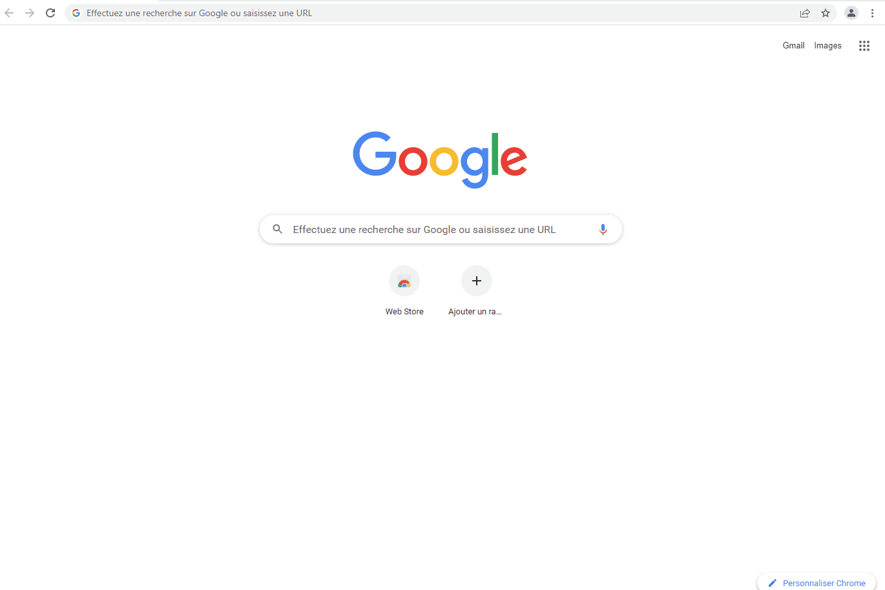

# Signal Binding

This binding connects to the Signal network and allows openHAB to send and receive message through it.

This binding rely on a binary library compiled for specific architecture. These architectures are theoretically supported:

* amd64 for Windows
* amd64 for Linux
* arm for Linux
* aarch64/arm64 for Linux
* aarch64 for OSX
* amd64 for OSX

## Supported Things

Things supported by this binding :

- A *signalaccount*, representing a fully fledged account, with a number dedicated to it.
- A *signallinkedaccount*, representing a "linked" account, when you want to share your personal number with it.
- A *signalconversation*, representing a conversation with another user.

## Discovery

There is no discovery process for *signalaccount* or *signallinkedaccount* thing.
A *signalconversation* thing will be discovered and added to the inbox everytime the bridge should receive a message by a new sender.

## Storage and security

Signal is a highly secured protocol. This binding, not so much.

Be aware that this Signal binding stores secret keys, id, etc, on your disk (unencrypted). Take appropriate measures protecting the directory <OPENHAB_USER_DIR>/signal/<bridgeid>.

Also, note that if you use docker with openHAB, you have to lift the cryptography restrictions. See [this link](https://github.com/openhab/openhab-docker#java-cryptographic-strength-policy) for more details.


## Captcha (for signalaccount only)

Unfortunately, registering a custom agent (a non-mobile device), is tedious. Signal protects its network with a captcha anti-bot registration system.

So, the Signal network will probably require a captcha to register your number. This is a string, returned by a dedicated web page, proving that you are a human. You have then to provide it to the binding.

In order to get one, you have to pass a verification check on the URL https://signalcaptchas.org/registration/generate.html and intercept the response with the browser developer tool (use Chrome for this). You can see the full procedure in the following screencap.



## Thing Configuration

A bridge thing, either a *signalaccount* or a *signallinkedaccount*, is required.

### Dedicated Signal Account

If you have a dedicated number available and not already linked to a device, this should be your first choice.
Tip : you can use a landline number. The only requirement is that your can receive SMS or voice call from the Signal service.

Because Signal requires several verifications, the signal account thing creation is a several steps process.

* At first, you have to get a valid captcha proving that you are human. You can try without one but Signal will probably reject your attempt (see above).
* Second, you have to get a verification code proving that you own the phone number. In order to do so, create the bridge thing, without the verification code. You will then receive a SMS or a voice call with the verification code.
* Third, set the verificationCode parameter and then save your thing, again.

For a *signalaccount*, the following parameters are available:

| Parameter Name | type | required   | description |
|----------------|------|------------|-------------|
|phoneNumber| text | yes | A dedicated phone number |
|captcha| text | Probably | See dedicated section |
|verificationCodeMethod| text | no | You can set this value to "TextMessage" (default) to get a SMS or "PhoneCall" to get a voice call|
|verificationCode| text | At first no, then yes | The verification code Signal sent you |

### Linked Signal Account

You can use this bridge thing if you have no spare phone number. You will use your mobile phone application.
This is also a several steps registration process.

* At first, create the thing. It will be in the CONFIGURATION_PENDING state.
* Then, you have to open the thing with the main UI, and scan the QR code with your Signal application on your phone (linked devices menu).

| Parameter Name | type | required | description    |
|----------------|------|----------|----------------|
|deviceName| text | no | A friendly name for display|
|phoneNumber| text | yes | The shared phone number |


### Conversation

The *signalconversation* thing is just a shortcut to address/receive messages with a specific number, with convenient item. It is not mandatory to use the binding, as you can use action and trigger channel to send/receive a message once the signal bridge is configured.

| Parameter Name | type | description |
|-----------|----------|----------|
| recipient | text | The phone number.|


## Channels

### Trigger channels

The *signalaccount* and *signallinkedaccount* has the following trigger channel :
| Channel ID          | event                      |  
|---------------------|----------------------------|
|receivetrigger| The number and the message received (concatened with the '\|' character as a separator)|

The *signalconversation* supports the following channels :

| channel  | type   | description                  |
|----------|--------|------------------------------|
| receive | String| The last message received |
| send | String| A message to send |
|deliverystatus| String| Delivery status (either SENT, DELIVERED, READ, FAILED)|


## Rule action

This binding includes a rule action to send messages.

```
(Rule DSL)
val signalAction = getActions("signal", "signal:signallinkedbridge:<uid>")
```

```
(javascript JSR)
var signalAction = actions.get("signal", "signal:signalaccountbridge:<uid>");
```

Where uid is the Bridge UID of the *signalaccount* or *signallinkedaccount* thing.

Once this action instance is retrieved, you can invoke the 'sendSignal' method on it:

```
signalAction.sendSignal("+33123456789", "Hello world!")
```

When using the linked bridge thing, you can use the special recipient "self" to send note to yourself. When sending note to yourself, there is no notification on your other devices.

If you want notification when sending message to your own account, use the send action with your full number.

## Full Example

### Thing configuration

things/signal.things:

```
Bridge signal:signalaccountbridge:mymainsignalaccount "Signal account for my number" [ phoneNumber="+336123546879", captcha="signalcaptcha://signal-recaptcha-v2.6LfBXs0bAAAAAAjkDyyI1Lk5gBAUWfhI_bIyox5W....", verificationCodeMethod="TextMessage", verificationCode="677484" ] {
    Thing signalconversation aconversationname [ recipient="+33987654321" ]
}
```

### Send message

`signal.rules` for DSL:

```java
rule "Alarm by SIGNAL"
when
   Item Alarm changed
then
   val signalAction = getActions("signal","signal:signalaccountbridge:mymainsignalaccount")
   signalAction.sendSignal("+33123456789", "Alert !")
end
```

### Receive and forward message

`signal.py` with the python helper library :

```python
@rule("signalcommand.receive", description="Receive SMS and return it")
@when("Channel signal:signalaccountbridge:mymainsignalaccount:receivetrigger triggered")
def signalcommand(event):
    sender_and_message = event.event.split("|")
    sender = sender_and_message[0]
    content = sender_and_message[1]
    actions.get("signal", "signal:signalaccountbridge:mymainsignalaccount").send("+336123456789", sender + " just send the following message: " + content)
```
